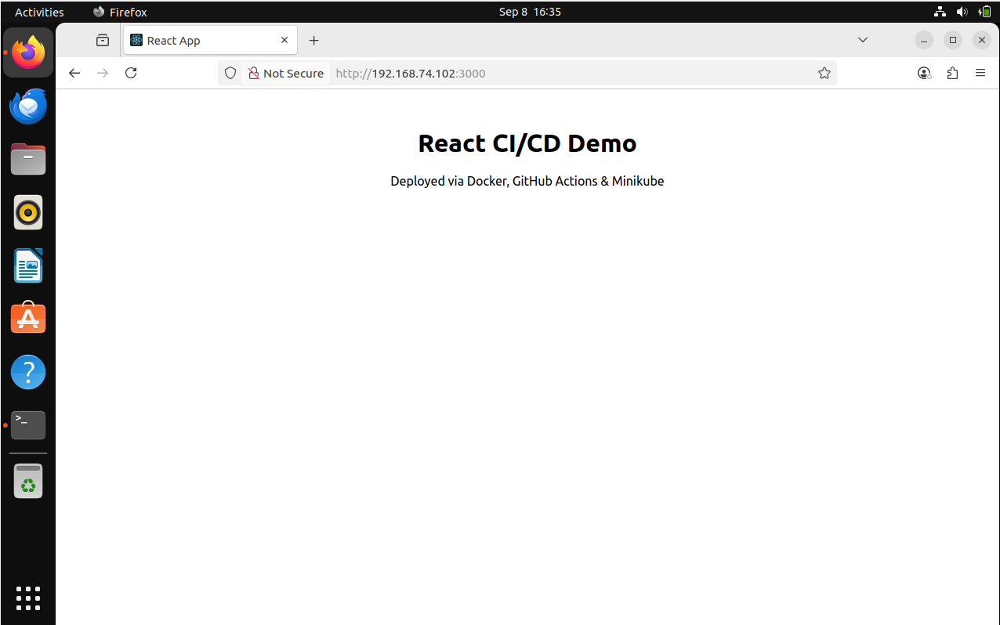
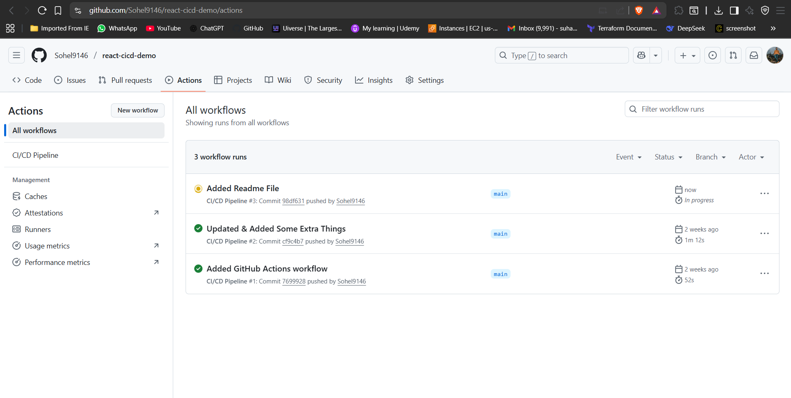
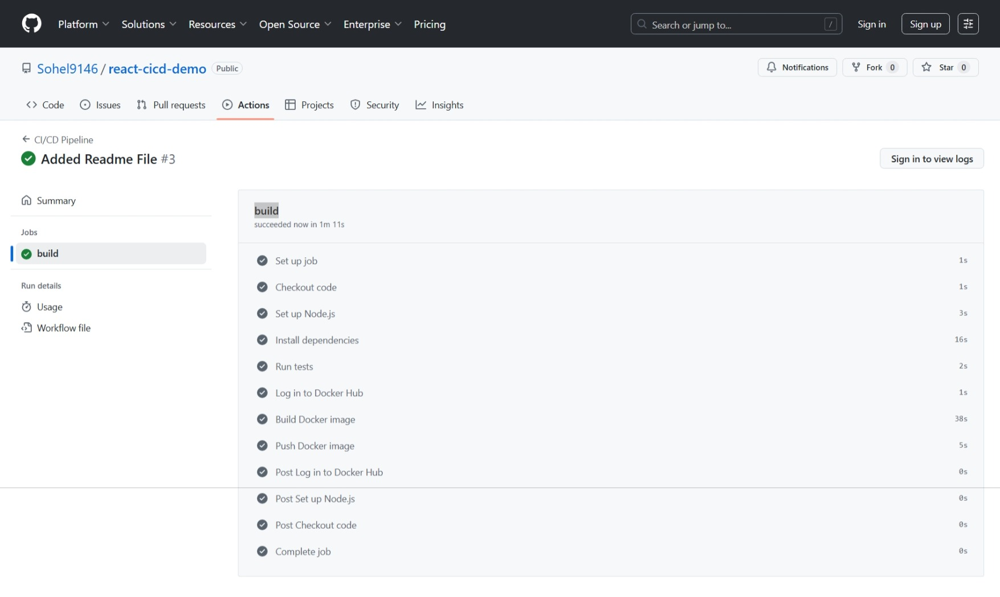
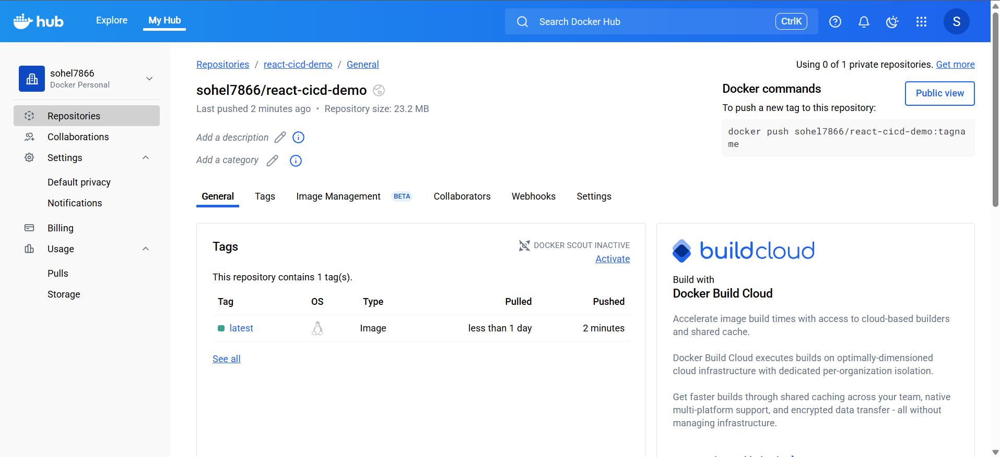
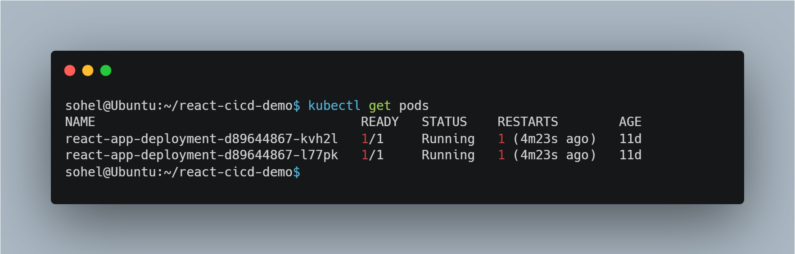
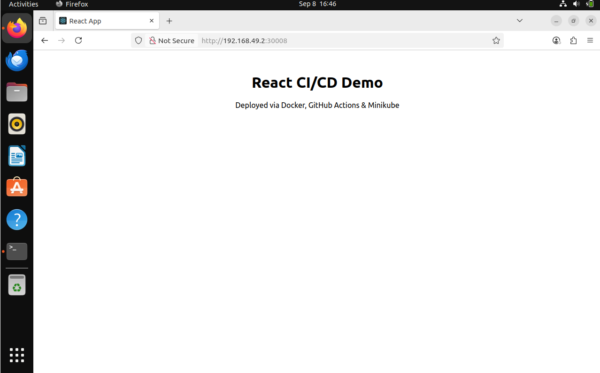

# ⚛️ React CI/CD Demo

[](https://react.dev/)
[](https://www.docker.com/)
[](https://github.com/features/actions)
[](https://kubernetes.io/)
[](LICENSE)
[](https://github.com/Sohel9146/react-cicd-demo/stargazers)

A **demo project** that shows how to build, test, and deploy a **React application** using **Docker, GitHub Actions CI/CD pipelines, and Kubernetes**.

---

## 📋 Table of Contents
- [Features](#-features)
- [Tech Stack](#-tech-stack)
- [Prerequisites](#-prerequisites)
- [Installation & Local Setup](#️-installation--local-setup)
- [CI/CD Workflow](#-cicd-workflow)
- [Kubernetes Deployment](#-kubernetes-deployment)
- [Usage](#-usage)
- [Architecture](#-architecture)
- [Project Structure](#-project-structure)
- [Screenshots](#-screenshots)
- [Use Case / Why This Project Matters](#-use-case--why-this-project-matters)
- [Key Learnings](#-key-learnings)
- [Future Enhancements / Roadmap](#-roadmap)
- [Contributing](#-contributing)
- [Author](#-author)

---

## ✅ Features
- ⚛️ React-based frontend application  
- 🐳 Dockerized for consistent builds  
- ⚙️ Automated CI/CD with **GitHub Actions**  
- ☸️ Kubernetes manifests for deployment  
- 🔄 End-to-end workflow from **code → build → test → deploy**  

---

## 🛠 Tech Stack
- **Frontend**: React, JavaScript  
- **Containerization**: Docker  
- **CI/CD**: GitHub Actions  
- **Orchestration**: Kubernetes  
- **Version Control**: Git + GitHub  

---

## 🛠 Prerequisites
Before starting, ensure you have:
- [Node.js](https://nodejs.org/) (for local development)
- [Git](https://git-scm.com/)  
- [Docker](https://docs.docker.com/get-docker/)  
- [kubectl](https://kubernetes.io/docs/tasks/tools/)  
- [Minikube](https://minikube.sigs.k8s.io/docs/start/) or a Kubernetes cluster  

---

## ⚙️ Installation & Local Setup

### 1. Clone the Repository
```bash
git clone https://github.com/Sohel9146/react-cicd-demo.git
cd react-cicd-demo
```

### 2. Install Dependencies
```bash
npm install
```

### 3. Run Locally
```bash
npm start
```
The app will be available at 👉 `http://localhost:3000`

---

## 🤖 CI/CD Workflow
This project uses **GitHub Actions** for automated CI/CD.

### ✅ Pipeline Stages:
1. **Build** – Installs dependencies and builds the React app.  
2. **Test** – Runs unit tests (if available).  
3. **Dockerize** – Builds and pushes Docker image.  
4. **Deploy** – Applies Kubernetes manifests for deployment.  

Workflow file: `.github/workflows/ci-cd.yml`

---

## ☸️ Kubernetes Deployment

### 1. Build & Push Docker Image
```bash
docker build -t <dockerhub-username>/react-cicd-demo:v1 .
docker push <dockerhub-username>/react-cicd-demo:v1
```

### 2. Apply Kubernetes Manifests
```bash
kubectl apply -f k8s-manifests/
```

### 3. Access the Application
If using Minikube:
```bash
minikube service react-cicd-demo-service -n default
```

---

## ▶️ Usage
- Visit the service URL exposed by Kubernetes to access the **React App**.  
- Push code changes to the repo → GitHub Actions triggers build & deploy.  

---

## 🏗 Architecture
**Workflow:**  
`React Source Code` → `GitHub Actions (CI/CD)` → `Docker Image` → `Kubernetes Cluster` → `React App`

---

## 📂 Project Structure
```
├── .github/workflows/     # GitHub Actions workflows
├── k8s-manifests/         # Kubernetes deployment and service YAMLs
├── public/                # Static assets
├── src/                   # React source code
├── Dockerfile             # Docker build instructions
├── package.json           # Project dependencies
└── README.md              # Documentation
```

---

## 📸 Screenshots

- **React App Running**  


- **GitHub Actions**  


- **GitHub Actions Pipeline Stages**  


- **Docker Hub Image**  


- **Kubernetes Pods**  


- **App Deployed via Minikube**  


---

## 💡 Use Case / Why This Project Matters
This project demonstrates a **real-world CI/CD pipeline** for modern web apps:
- Every code push is automatically built, tested, and deployed  
- Ensures **faster feedback loops** and **production-like deployments**  
- Bridges **Dev** and **Ops** with GitHub Actions + Kubernetes  

---

## 📚 Key Learnings
- Setting up **CI/CD pipelines with GitHub Actions**  
- Containerizing apps with **Docker**  
- Deploying React apps on **Kubernetes**  
- Automating end-to-end delivery pipelines  

---

## 🔮 Roadmap
- [ ] Add unit tests with Jest  
- [ ] Integrate code quality checks (SonarQube / ESLint)  
- [ ] Add staging & production environments  
- [ ] Deploy on AWS EKS or GKE  

---

## 🤝 Contributing
Contributions are welcome!  
To contribute:
1. Fork this repo  
2. Create your feature branch (`git checkout -b feature/...`)  
3. Commit your changes (`git commit -m 'Add feature'`)  
4. Push to your branch (`git push origin feature/...`)  
5. Open a Pull Request  

---

## 👨‍💻 Author
**Shaikh Sohel**  
[GitHub](https://github.com/Sohel9146) | [Naukri](https://www.naukri.com/mnjuser/profile)    

---
